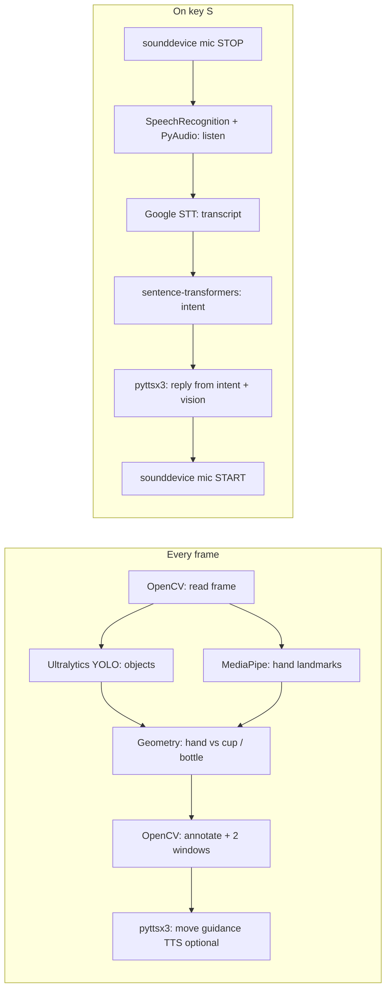

# comp5523 — hand / bottle vision + voice intent

## How to run

1. **Python**  
   Use Python **3.10+** (3.11 or 3.12 is fine).

2. **Create a virtual environment** (recommended)

   ```bash
   cd /path/to/comp5523
   python3 -m venv .venv
   source .venv/bin/activate   # Windows: .venv\Scripts\activate
   ```

3. **Install dependencies**

   ```bash
   pip install --upgrade pip
   pip install -r requirements.txt
   ```

   **macOS:** If `PyAudio` fails with `portaudio.h` not found, install PortAudio first, then retry:

   ```bash
   brew install portaudio
   pip install pyaudio
   ```

4. **Run the app**

   ```bash
   python main.py
   ```

5. **First launch**  
   - The first run may download **`hand_landmarker.task`** (MediaPipe) and **`yolov8n.pt`** (Ultralytics YOLO).  
   - The first time you use speech intent, **SentenceTransformer** may download **`all-MiniLM-L6-v2`**.  
   These need a working internet connection.

6. **Use the windows**  
   - Focus the **Webcam** window so keyboard shortcuts work.  
   - **`S`** — listen once, transcribe (Google), classify intent, and show a bottle-position answer when the intent is “where is the bottle”.  
   - **`Q`** — quit.

7. **Permissions (macOS)**  
   Allow the terminal or IDE to use the **camera** and **microphone** under **System Settings → Privacy & Security**.

---

## Application flow

At a high level the program runs **one continuous vision loop** (webcam → detect → draw → show) and **optional speech** on demand (key **`S`**). Speech temporarily releases the microphone from the “always on” capture so **PyAudio** can record for recognition.



### Stage 1 — Startup and models

| What happens | Libraries / modules |
|--------------|---------------------|
| Resolve paths and, if missing, **download** `hand_landmarker.task` | **urllib.request**, **pathlib** |
| Load **YOLOv8** weights (`yolov8n.pt`) and restrict classes to person / cup / bottle | **ultralytics** (uses **PyTorch** and **NumPy** under the hood) |
| Create a **MediaPipe Hand Landmarker** in video mode (two hands) | **mediapipe** (Tasks API: `vision.HandLandmarker`) |
| Open the default **webcam** | **OpenCV** (`cv2.VideoCapture`) |
| Start a lightweight **input stream** that keeps the default mic “active” (buffers drained in a callback) | **sounddevice** (`audio.MicrophoneStream`) — avoids fighting the device between the main loop and speech |

### Stage 2 — Main loop (each frame)

| Step | Libraries / modules |
|------|---------------------|
| Grab a BGR frame from the camera | **OpenCV** |
| Run **object detection** on the frame; keep only filtered COCO classes; get an annotated overlay | **ultralytics** **YOLO** |
| Convert BGR → RGB and build a MediaPipe **Image**; run hand detection for this timestamp | **OpenCV**, **mediapipe** (`Image`, `ImageFormat`, `detect_for_video`) |
| Draw hand skeletons on the annotated frame | **mediapipe** drawing utilities |
| Convert hand landmarks to **pixel bounding boxes**; extract cup / bottle boxes from YOLO | **NumPy** (box tensors), plain Python, **math** for distances |
| Compute **closest hand** to highest-confidence cup and bottle; derive dx/dy, distance, and short text hints | Custom logic in `main.py` |
| **Real-time guidance**: if hand and bottle are both visible, optionally speak “move left/right/up/down” (throttled so TTS is not spammed) | **pyttsx3** via `tts_speak.speak` (queued on a **threading** worker) |
| Overlay status text on the video; show **Webcam** + **Hand vs bottle data** panel | **OpenCV** (`imshow`, `putText`, **NumPy** panel image) |
| Handle keys **`Q`** (quit) and **`S`** (start speech worker) | **OpenCV** `waitKey` |

### Stage 3 — Speech path (when you press **`S`**)

| Step | Libraries / modules |
|------|---------------------|
| Run recognition on a **background thread** so the OpenCV loop keeps updating | **threading** |
| **Stop** the `sounddevice` stream so the microphone is free | **sounddevice** (`MicrophoneStream.stop`) |
| Open **PyAudio** via SpeechRecognition’s microphone context, adjust for ambient noise, listen once | **SpeechRecognition**, **PyAudio** |
| Send audio to **Google’s speech-to-text** (cloud; needs network) | **SpeechRecognition** → Google API |
| Embed the transcript and compare to example phrases with **cosine similarity**; pick best intent or `UNKNOWN` | **sentence-transformers** (`SentenceTransformer`, **NumPy** for vector math) — `intent_semantic.py` |
| **Restart** the `sounddevice` stream | **sounddevice** (`MicrophoneStream.start`) |
| When the worker finishes, **main** picks up transcript + intent; for “where is the bottle”, compute a **natural-language answer** from the **current** hand/bottle geometry | `main.py` + `bottle_position_answer` |
| Speak the appropriate reply (bottle answer, greeting, or fallback) without blocking the UI loop | **pyttsx3** via `tts_speak.speak_for_intent` (**threading** + queue in `tts_speak.py`) |

### Stage 4 — Shutdown

| What happens | Libraries / modules |
|--------------|---------------------|
| Wait for an in-flight speech thread (bounded timeout) | **threading** |
| Stop TTS worker cleanly | **pyttsx3** / `tts_speak.shutdown_tts` |
| Close microphone stream, MediaPipe landmarker, camera, destroy windows | **sounddevice**, **mediapipe**, **OpenCV** |

---

## Dependencies (`requirements.txt`) — what each is for

| Package | Role in this project |
|---------|----------------------|
| **opencv-python** | Webcam I/O, windows, drawing overlays and the secondary data panel, BGR→RGB conversion for MediaPipe. |
| **numpy** | Image buffers (e.g. data panel), numerical ops in intent similarity; also used heavily by YOLO / torch stacks. |
| **mediapipe** | Hand landmark detection and skeleton drawing in real time (`.task` model file). |
| **ultralytics** | YOLOv8 object detection for cups, bottles, and people in each frame. |
| **sounddevice** | Holds the default input device open between speech turns so recording hand-off is predictable (`audio.py`). |
| **SpeechRecognition** | High-level API: ambient noise calibration, microphone capture, Google transcription. |
| **pyaudio** | Low-level microphone access required by SpeechRecognition’s `Microphone`. |
| **sentence-transformers** | Local semantic intent: embed user text and example phrases, classify by similarity (`intent_semantic.py`). |
| **pyttsx3** | Offline text-to-speech for guidance and replies on macOS without extra TTS services (`tts_speak.py`). |

**Standard library** pieces used in `main.py` include **threading** (speech worker), **urllib.request** (first-time model download), **pathlib** (paths), and **math** (pixel distances).

---

Speech recognition uses Google’s web API (requires network). Semantic intent uses **sentence-transformers** locally after the model is cached.
